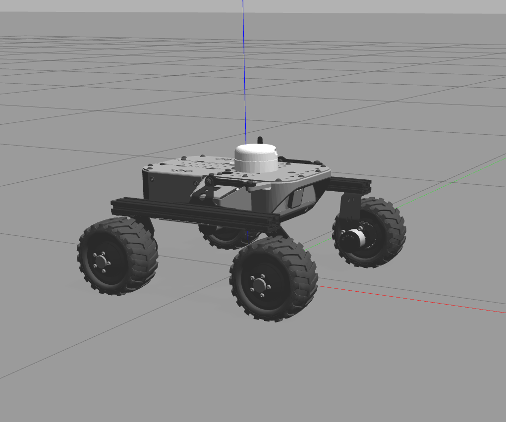

# ROS Test
In this repository you will know how to run in a simulation environment a [LEO ROVER](https://www.leorover.tech/), also you can do the leo rover follow a AR tag.The simulation software is gazebo and the robot is running in base of ROS 1 in the noetic version.

## Simulation

### LeoRover



First to run the simulation and get the leo rover as the image above, you need to pull the next container [here](https://hub.docker.com/r/cjb873/sim_image). If you have a nvidia graphic card I advice run the docker with nvidia access to get better simulation performance and more FPS.

```
docker run -p 9000:80 --name sim -it --gpus all cjb873/sim_image:1.0
```

Once you run the docker container you can run the simulation of leo_rover
```
cd ~/catkin_ws

catkin_make

roslaunch leo_gazebo leo_gazebo.launch
``` 

### ARTags
ARTags can be found in the models section of gazebo. Now with the simulation running you can open a new terminal and start the ARTag tracking node, use the next command:

```
roslaunch rover_api alvar.launch
```

### AR Following

Once you have setup your environment, to run the ar_following you need to clone this repository in your `catkin_ws/src` folder

```
https://github.com/JuanCarlos-TiqueRangel/leo_ar_follower.git
```

Then build the `leo_ar_follower`. You can do this with `catkin_make`
```
cd ~/catkin_ws

catkin_make
```

In this repository you will see three executables python files [ar_follower.py](src/ar_follower.py), [dynamic_ar_tag.py](src/dynamic_ar_tag.py) and [ar_follower_interactive.py](src/ar_follower_interactive.py). To interact with the ARTags you need to insert it in the gazebo world. They are located in the insert path window. If you want to a simple AR follower an interact with the ARTag manually you just need to run the command below:

```
rosrun leo_ar_follower ar_follower.py
```

The current ARTag is the `Marker0` if you want to use another different for example the `Marker16` change the next line of code, change the `0` to `16` instead and you will use the system will recognize the `Marker16`.

https://github.com/JuanCarlos-TiqueRangel/leo_ar_follower/blob/3ba2c648840a45fbc4d6c8ff8879e6882ac5ea4a/src/ar_follower.py#L27

The expected behavior will be the next

https://github.com/JuanCarlos-TiqueRangel/leo_ar_follower/assets/47435355/a186d881-0d7e-46d1-ab25-79035db5abcd

Now the repository has an interactive method that move automatically the ARTag around the environment and the robot will follow it. To run this you have to cancel the ar_follower.py and now run the code that move dynamically the ARTag:

```
rosrun leo_ar_follower dynamic_ar_tag.py
```

In other terminal run the AR follower that will send to the dynamic_ar_tag the answer when it achieves the goal.

```
rosrun leo_ar_follower ar_follower_interactive.py
```
*Note:* This program was designed to run when the robot is located in the initial position o near to it.

[](https://github.com/JuanCarlos-TiqueRangel/leo_ar_follower/assets/47435355/e0521444-4dde-4121-a248-906c348b21cd)


